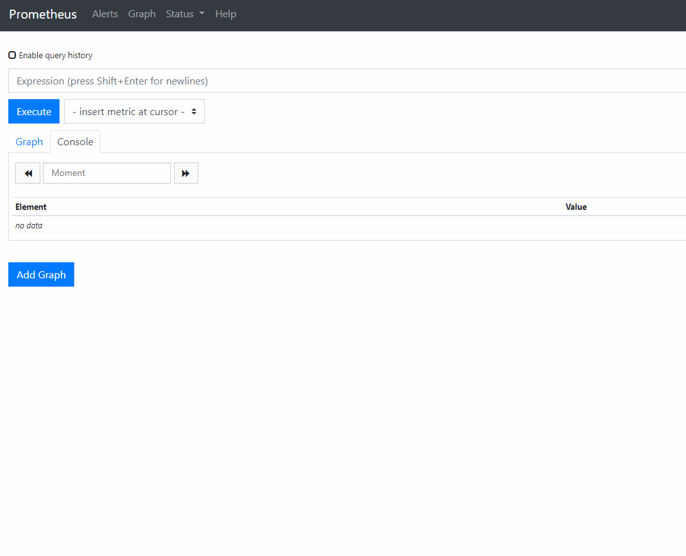

k8s master主节点
所用的镜像：

```
quay.io/coreos/configmap-reload:v0.0.1
k8s.gcr.io/addon-resizer:1.8.4
quay.io/coreos/k8s-prometheus-adapter-amd64:v0.4.1
quay.io/coreos/kube-rbac-proxy:v0.4.1
quay.io/coreos/kube-state-metrics:v1.7.2
quay.io/coreos/prometheus-operator:v0.31.1
quay.io/prometheus/node-exporter:v0.18.1
quay.io/prometheus/prometheus:v2.11.0
quay.io/prometheus/alertmanager:v0.18.0
```

```
for i in *.tar;do docker load < $i;done
```

addon-resizer:1.8.4镜像从阿里云拉取

```
docker pull registry.cn-beijing.aliyuncs.com/minminmsn/addon-resizer:1.8.4
docker tag registry.cn-beijing.aliyuncs.com/minminmsn/addon-resizer:1.8.4 k8s.gcr.io/addon-resizer:1.8.4
```

```
kubectl apply -f 00namespace-namespace.yaml
# kubectl get namespace
NAME          STATUS   AGE
monitoring    Active   6s
```

```
for i in 0prometheus-operator*;do kubectl apply -f $i;done
# kubectl get crd
NAME                                    CREATED AT
alertmanagers.monitoring.coreos.com     2019-08-29T08:25:29Z
podmonitors.monitoring.coreos.com       2019-08-29T08:25:30Z
prometheuses.monitoring.coreos.com      2019-08-29T08:25:30Z
prometheusrules.monitoring.coreos.com   2019-08-29T08:25:30Z
servicemonitors.monitoring.coreos.com   2019-08-29T08:25:30Z
```

因为没有对node节点打标签，所以注释,编辑下面文件，注释nodeSelector 和 kubernetes.io/os: linux 两行
```
    0prometheus-operator-deployment.yaml prometheus-adapter-deployment.yaml  kube-state-metrics-deployment.yaml prometheus-prometheus.yaml
          #nodeSelector:
          #  kubernetes.io/os: linux
```

```
for i in prometheus-adapter*;do kubectl apply -f $i;done
for i in node-exporter*;do kubectl apply -f $i;done
for i in kube-state-metrics*;do kubectl apply -f $i;done
for i in prometheus-cluster* prometheus-role* prometheus-service* prometheus-rules.yaml kube-k8s-service.yaml;do kubectl apply -f $i;done
kubectl apply -f prometheus-prometheus.yaml
for i in alertmanager*;do kubectl apply -f $i;done
```

prometheus安装完毕，需要修改一下配置

```
kubectl edit svc prometheus-k8s -n monitoring
spec:
  clusterIP: 10.200.3.200
  ports:
  - name: web
    port: 9090
    protocol: TCP
    targetPort: web
    nodePort: 30209
  selector:
    app: prometheus
    prometheus: k8s
  sessionAffinity: ClientIP
  sessionAffinityConfig:
    clientIP:
      timeoutSeconds: 10800
  type: NodePort
status:
  loadBalancer: {}
```

浏览器打开prometheus面板 NodeIP:30209


kube-controller-manager和kube-scheduler需要修改一下配置

```
vim /etc/kubernetes/manifests/kube-controller-manager.yaml
metadata:
  annotations:
    scheduler.alpha.kubernetes.io/critical-pod: ""
  creationTimestamp: null
  labels:
    k8s-app: kube-controller-manager
    component: kube-controller-manager
    tier: control-plane
  name: kube-controller-manager
  namespace: kube-system
spec:
  containers:
  - command:
    - kube-controller-manager
    - --address=0.0.0.0

vim /etc/kubernetes/manifests/kube-scheduler.yaml
metadata:
  annotations:
    scheduler.alpha.kubernetes.io/critical-pod: ""
  creationTimestamp: null
  labels:
    k8s-app: kube-scheduler
    component: kube-scheduler
    tier: control-plane
  name: kube-scheduler
  namespace: kube-system
spec:
  containers:
  - command:
    - kube-scheduler
    - --address=0.0.0.0 
	
systemctl restart kubelet
```

    kubectl -n kube-system edit cm kube-proxy
        kind: KubeProxyConfiguration
        metricsBindAddress: 0.0.0.0:10249
        mode: ipvs

```
# kubectl get all -n monitoring 
NAME                                       READY   STATUS    RESTARTS   AGE
pod/alertmanager-main-0                    2/2     Running   0          15h
pod/alertmanager-main-1                    2/2     Running   0          15h
pod/alertmanager-main-2                    2/2     Running   0          15h
pod/kube-state-metrics-6df9f554fd-jfpds    4/4     Running   0          16h
pod/node-exporter-2tmk9                    2/2     Running   0          45m
pod/node-exporter-65ggs                    2/2     Running   0          45m
pod/node-exporter-7c7jf                    2/2     Running   0          45m
pod/node-exporter-9vpvt                    2/2     Running   0          45m
pod/node-exporter-hfbql                    2/2     Running   0          45m
pod/node-exporter-rchsp                    2/2     Running   0          45m
pod/node-exporter-ssthp                    2/2     Running   0          45m
pod/node-exporter-vtqnt                    2/2     Running   0          45m
pod/prometheus-adapter-5cc8b5d556-pj7xx    1/1     Running   0          17h
pod/prometheus-k8s-0                       3/3     Running   1          16h
pod/prometheus-k8s-1                       3/3     Running   0          16h
pod/prometheus-operator-6cf99986cb-dls8z   1/1     Running   0          28m

NAME                            TYPE        CLUSTER-IP      EXTERNAL-IP   PORT(S)             AGE
service/alertmanager-main       ClusterIP   10.200.20.67    <none>        9093/TCP            15h
service/alertmanager-operated   ClusterIP   None            <none>        9093/TCP,6783/TCP   15h
service/kube-state-metrics      ClusterIP   None            <none>        8443/TCP,9443/TCP   16h
service/node-exporter           ClusterIP   None            <none>        9100/TCP            17h
service/prometheus-adapter      ClusterIP   10.200.28.187   <none>        443/TCP             17h
service/prometheus-k8s          NodePort    10.200.3.200    <none>        9090:30209/TCP      16h
service/prometheus-operated     ClusterIP   None            <none>        9090/TCP            16h
service/prometheus-operator     ClusterIP   None            <none>        8080/TCP            17h

NAME                           DESIRED   CURRENT   READY   UP-TO-DATE   AVAILABLE   NODE SELECTOR   AGE
daemonset.apps/node-exporter   8         8         8       8            8           <none>          17h

NAME                                  READY   UP-TO-DATE   AVAILABLE   AGE
deployment.apps/kube-state-metrics    1/1     1            1           16h
deployment.apps/prometheus-adapter    1/1     1            1           17h
deployment.apps/prometheus-operator   1/1     1            1           17h

NAME                                             DESIRED   CURRENT   READY   AGE
replicaset.apps/kube-state-metrics-6df9f554fd    1         1         1       16h
replicaset.apps/kube-state-metrics-759ff4547b    0         0         0       16h
replicaset.apps/kube-state-metrics-894b59c54     0         0         0       16h
replicaset.apps/prometheus-adapter-5cc8b5d556    1         1         1       17h
replicaset.apps/prometheus-operator-6cf99986cb   1         1         1       28m
replicaset.apps/prometheus-operator-7cfc488cdd   0         0         0       17h

NAME                                 READY   AGE
statefulset.apps/alertmanager-main   3/3     15h
statefulset.apps/prometheus-k8s      2/2     16h

```


